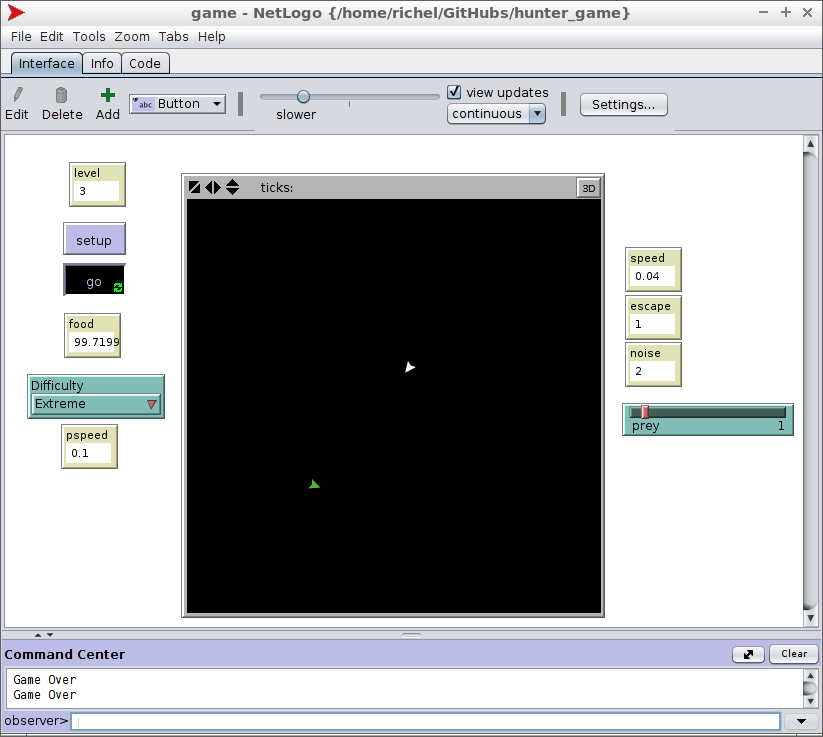

# hunter_game

NetLogo (v. 5.3.1) game by Rolf F. Storms.

This game was programmed due to a TRES event called 'fun programming', in which one
combines beer and programming.

Rolf was so enthousiastic, he wrote this game a day in advance.

 * [The Netlogo game file](game.nlogo)

## Manual

 * Click 'Setup'
 * Click 'Go'
 * Click on the prey to hunt it